## The PCB Download files [https://github.com/dlharmon/kicad-workshop](https://github.com/dlharmon/kicad-workshop)

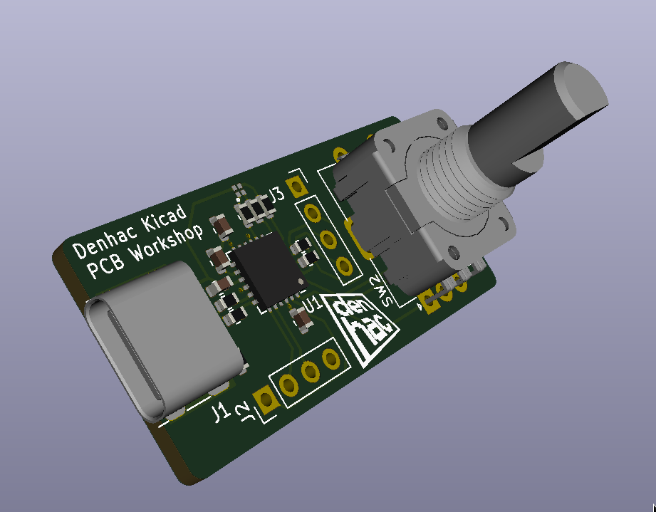{width=30%}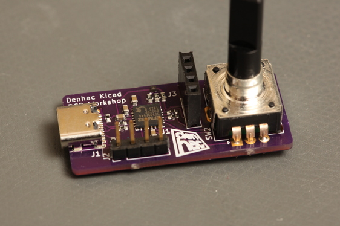{width=37%}

The goal was to create a inexpensive and simple PCB which demonstrates the use of Kicad, basic microcontroller interfacing and surface mount PCB assembly.

 - microcontroller with USB interface
 - Connector for OLED
 - Encoder
 - RGB LED
 - $2.97 parts cost ($1.75 microcontroller, $0.86 encoder, $0.25 USB C connector, $0.06 LED, $0.05 passives)

## PCB Material

 - FR-4: woven fiberglass with flame retardant epoxy resin
 - avoid breathing the dust
 - OSHPark uses materials with high Tg (Shengyi S1141 170, Isola FR408). These withstand the higher temperatures associated with lead free reflow soldering.
 - Other materials exist from the paper based FR-2 used in consumer electronics to exotic teflon and polyimide based materials.

## Copper layers

 - One layer - copper on one side only
 - Two layer - copper on both sides usually with plated vias connecting
 - multilayer - copper on both sides and internal copper layers

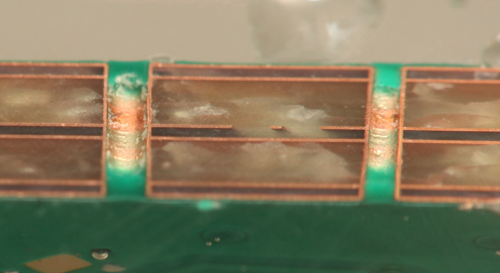{width=40%} 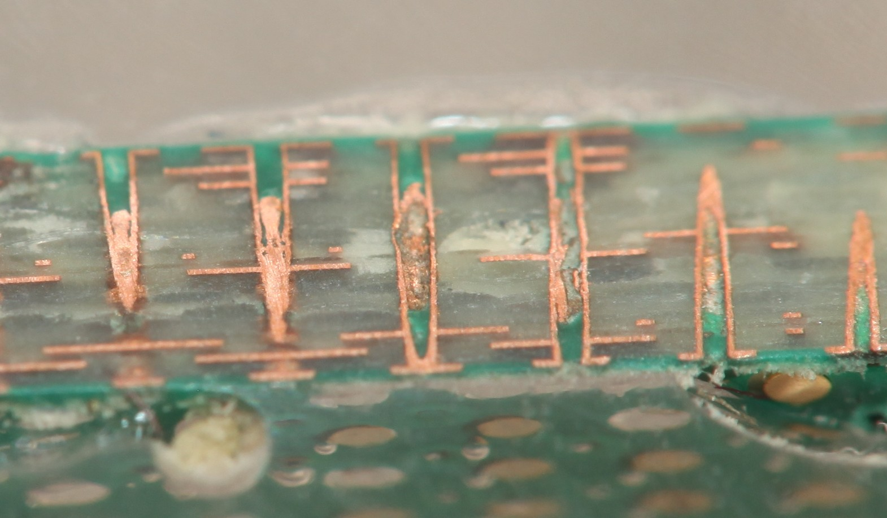{width=40%}

## Solder mask and silk screen

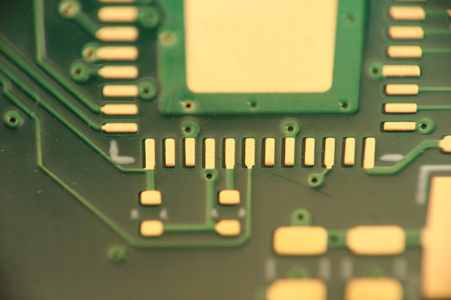

## Surface finish

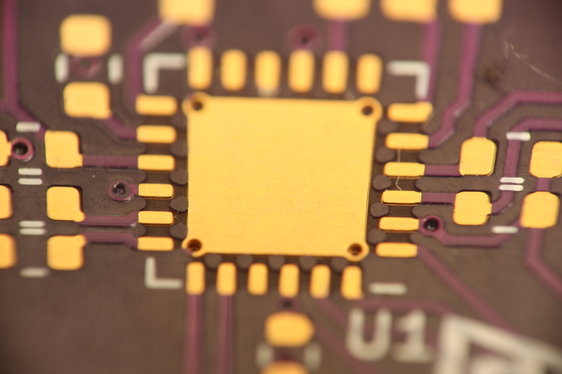{width=15%}

If left bare, copper would oxidize reducing solderability.

 - ENIG (electroless nickel + immersion gold) standard with OSHPark, complex process, expensive, good for edge connectors, battery contacts, etc
 - HASL (hot air solder leveling), common, cheap. The board is dipped in molten solder and the excess is blown off with hot air. Often contains lead. Causes problems for QFN and BGA assembly. Thermally stresses boards.
 - OSP (organic solderability preservative), common in China, cheap, works well, thin waxy coating to protect bare copper from oxidation
 - immersion silver - very thin silver plating plus a tarnish inhibitor. One of my favorite finishes.
 - less common options - electrolytic gold, etc

## Solder paste

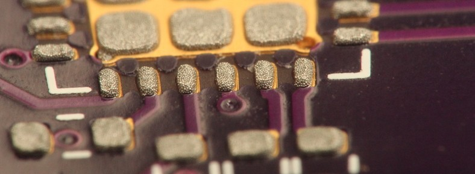

 - Solder spheres in gel flux
 - We will use Kester NXG-1 lead free paste available from OSHStencils for $15
 - flux strips oxides from metals when hot, NXG-1 does not require cleaning of residue
 - Keep refrigerated, limited shelf life, ship overnight in summer

## Terminology

 - Trace: copper foil connecting two points on a PCB.
 - Via: a drilled hole in the PCB, plated with copper to provide an electrical connection between layers
 - Pin: terminal of a component that connects electrically to the PCB, may not be a pin on modern components, but a ball or bit of exposed metal
 - Pad: copper area on a PCB intended to be soldered to a pin
 - Net: set of electrically connected items on a PCB
 - mil = 0.001 inch = 25.4 μm
 - oz = oz / sqft = 35 μm copper

## Design rules

 - Minimum drill sizes, trace widths, spacings, annular rings
 - OSHPark: 0.152 mm trace, 0.152 mm space, 0.254 mm minimum via hole, 0.508 mm minimum via pad
 - Some manufacturers check and will reject your files if not within the rules
 - OSHPark does not check and you can cheat, but don't expect a refund if you have shorts or opens
 - [OSHPark](https://docs.oshpark.com/design-tools/kicad/kicad-design-rules/)
 - [https://github.com/sethhillbrand/kicad_templates](https://github.com/sethhillbrand/kicad_templates)
 - Preferences->Configure Paths set KICAD_TEMPLATE_DIR to location of above

## PCB Manufacturing Panels

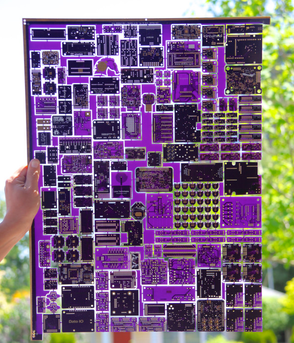{width=35%}

PCBs are manufactured on large panels. In the US, they are typically
24x18 inches. Most PCB manufacturers will tile a single board to cover
an entire panel resulting in high minimum order cost. Shared panel
manufacturers array many designs to reduce cost and waste. Photo: OSHPark

## Where to get PCBs and stencils

This is simply a list of some places I've used.

 - [OSHPark](https://oshpark.com) - Portland, OR shared panel service. Highly recommended.
   * Purple mask, except flex has clear mask, clear mask on black FR4 option
   * $5 per square inch 2 layer, 12 days or 5 days for 2x the price
   * $10 per square inch 4 layer, 12 days
   * $10 per square inch 2 layer flex
 - [EuroCircuits](https://eurocircuits.com) - shared panel, more options than most
 - [PCBPool](https://pcb-pool.com) - Ireland, shared panel, offers 6 layer
 - [JLCPCB](https://jlcpcb.com) - China, shared panel service, low prices, good quality. Does make some edits to files submitted before printing. Offers stencils and parts too. $17 DHL shipping.
 - [WellPCB](https://wellpcb.com) - China, build to spec
 - [Circuits West](http://circuitswest.com) - Longmont, CO
 - [Advanced Circuits](https://4pcb.com) - Aurora,  CO

### Stencils
 [OSHStencils](https://oshstencils.com): fast, reasonable cost. Stainless steel or polyimide plastic.

## Where to get parts
 - [Digikey](https://digikey.com) - best search, lots of stock
 - [Mouser](https://mouser.com) - similar to Digikey, search is not quite as good, but decent
 - [Arrow](https://arrow.com), [Avnet](https://avnet.com) - traditional distributors, pricing is negotiable
 - [Adafruit](https://www.adafruit.com/), [SparkFun](https://sparkfun.com) - Hobbyist friendly, less overwhelming selection.
 - [LCSC](https://lcsc.com) - China, low prices, not an authorized distributor for some of what they sell.
 - [Aliexpress](https://aliexpress.com), [Ebay](https://ebay.com), Amazon sellers - use caution.

 - [FindChips](https://findchips.com), [Octopart](https://octopart.com): parts search sites, shows price and stock and many distributors

## Passive package size codes

{width=40%}

 - First 2 digits encode length, 2nd two width
 - The inch size codes are most prevalent including in metric countries.
 - the digits xy in the metric version encode x.y mm
 - the digits xy in the inch version encode 0.xx in

## Resistors

{width=40%}

 - $I=\frac{V}{R}$
 - 0603 is the smallest size marked with the value - 334 indicates $33\times10^4$ ohms
 - 2R00 indicates 2.00 ohms, other markings exist including an alphanumeric code
 - Thick film is by far the most common, cheapest (0603 size is < $5 for 5000 pieces), noisy
 - Thin film is preferred for precision analog, high end audio
 - Be aware of power rating, 0603 is typically 0.1 W, $P=I^2R=\frac{V^2}{R}$

## Capacitors

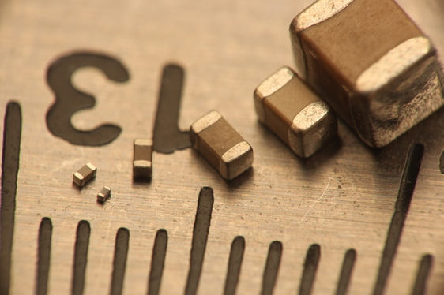{width=40%}

 - $I=C\frac{dv}{dt}$, no DC current flow, resists change in voltage across terminals
 - store energy
 - higher voltage and capacitance ratings require larger size
 - Many types: ceramic, film, wet aluminum electrolytic, polymer electrolytic, tantalum, etc.
 - Capacitors and their non-idealities are a highly complex topic

## Ceramic capacitors

{width=40%} 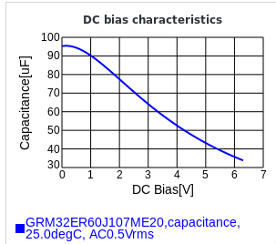{width=25%}

 - Ceramic is the most common capacitor and is highly reliable unless cracked
 - Numerous dielectrics avaliable with a wide range of properties
 - NP0/C0G are near ideal, low capacitace / volume, good for analog
 - X5R, X7R, X6S, etc have a large capacitance drop with applied voltage, some temperature variation, very common
 - Y5V, Z5U - avoid, large variation over temperature

## IC packages

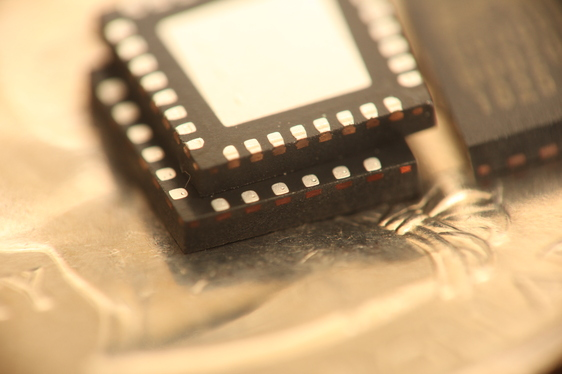{width=32%} 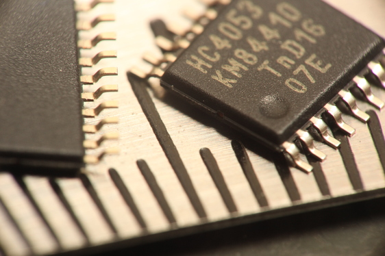{width=32%} 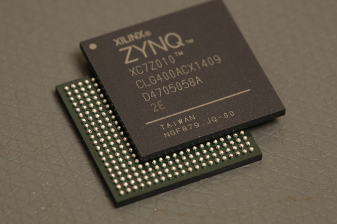{width=32%}

 - QFN, TSSOP, BGA
 - more variety than this out there
 - BGA has an undeserved reputation for being difficult

## Moisture sensitive and ESD sensitive parts

 - Moisture senstive - part absorbs water which boils in reflow, causing cracking, these parts are shipped with dessicant in special bags
 - ESD is when a person or object builds up charge and then discharges to a circuit or component, like when walking across carpet and then touching a metal object. This can be thousands of volts and can damage electronics. Our dry climate makes this problem worse. These parts should be kept in their bags and handled using an ESD mat and/or wrist strap. Nothing in this project is particularly sensitive.

## Get started - Create empty project

 - Add project specific schematic library (Preferences->Manage Symbol Libraries)
 - Add project specific footprints library (Preferences->Manage Footprint Libraries)
 - Set up schematic page properties

## USB C Device interface

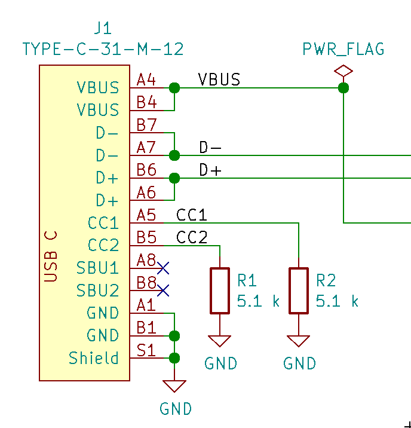{width=30%} 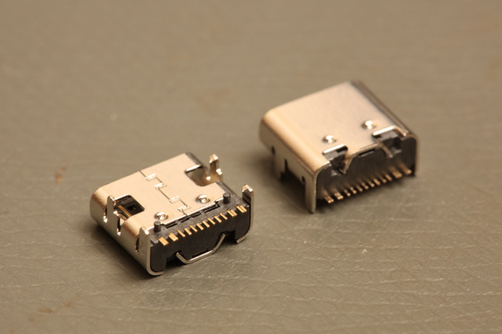{width=50%}

 - Add USB C symbol - kicad-workshop:USB-C_HRO16
 - Add ground symbol
 - add wires between USB ground pins, ground symbol
 - add a 5.1 k resistor (Device:R), set footprint, connect to CC2, ground
 - duplicate for CC1

## USB C Device interface (continued)

{width=30%} {width=50%}

 - label CC1, CC2
 - add wires to D-, D+, A6 and A7 will be connected in one cable orientation, B6, B7 in the other, so need to parallel.
 - add wires for VBUS
 - add no connects for SBU1, SBU2

## Microcontroller

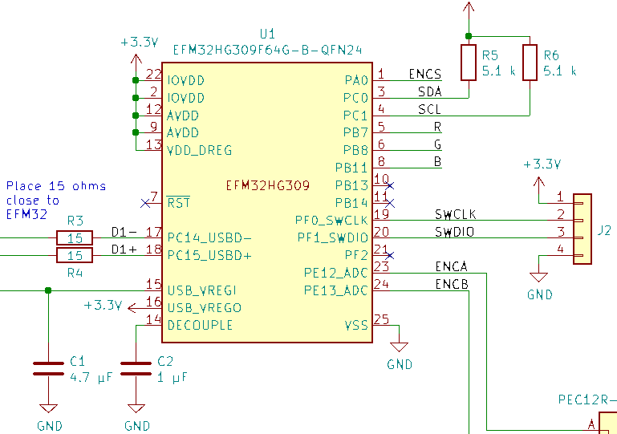{width=50%} 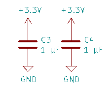{width=20%}

- Connect ground, 3.3 V symbols
 - Capacitors - data sheet, [AN0046](https://www.silabs.com/documents/public/application-notes/AN0046.pdf)
 - The USB spec and AN0046 conflict on connector grounding, following USB spec
 - Debug connector

## LED

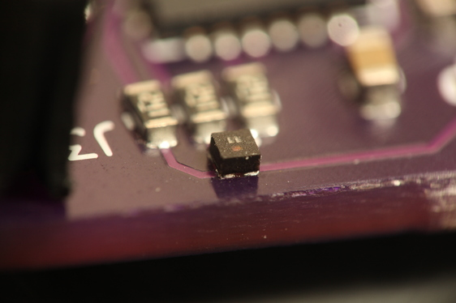{width=35%} 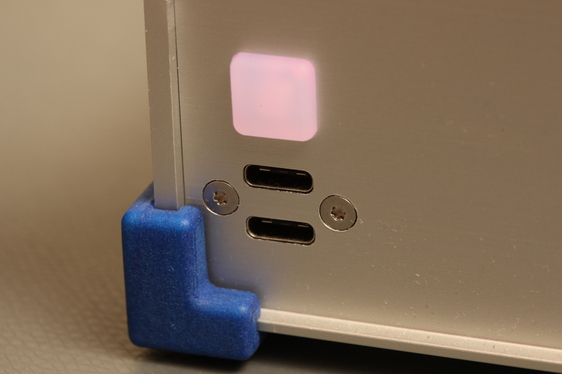{width=35%} 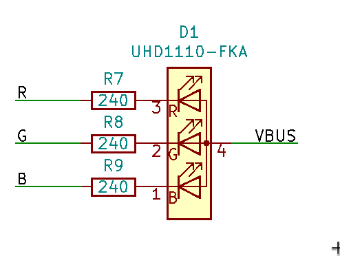{width=25%}

 - Symbol: kicad-workshop:UHD1110-FKA, Cree UHD1110-FKA
 - Footprint: kicad-workshop:LED_cree_4_1x1 (doesn't exist!)
 - Anode to VBUS (5 V) - requires up to 3.6 V so we can't use the 3.3 V supply
 - Current limiting resistors - $R_{min}=\frac{5.0 V - 1.9 V}{10 mA}$
 - Red cathode to PB7 via 330 ohms
 - Green cathode to PB8 via 330 ohms
 - Blue cathode to PB11 via 330 ohms
 - These pins connect to a timer peripheral capable of pulse width modulation

## Encoder

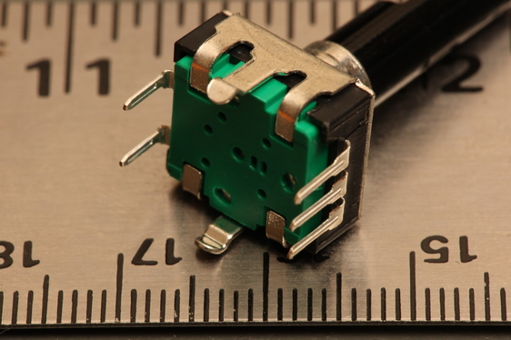{width=30%} 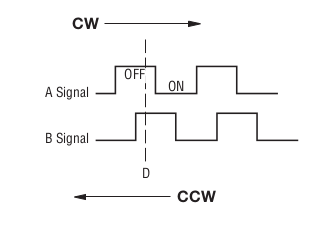{width=30%} 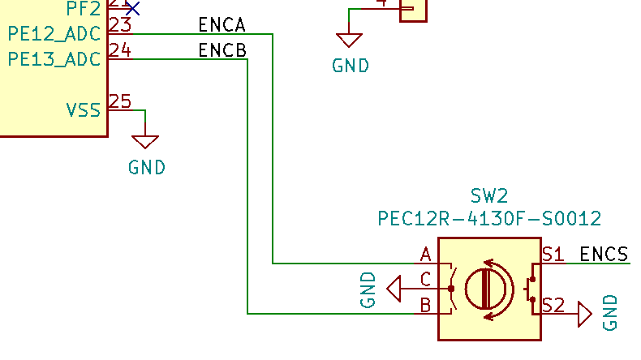{width=30%}

 - Symbol: Device:Rotary_Encoder_Switch
 - Value: PEC12R-4130F-S0012
 - Footprint: Rotary_Encoder:RotaryEncoder_Alps_EC12E-Switch_Vertical_H20mm
 - Pull up resistors enabled internal to the microcontroller hold lines at logic 1
 - Switches in the encoder connect lines to ground forcing logic 0
 - A to PE12, B to PE13, S1 to PA0

## OLED header
 - Create our own symbol
 - Pin 1: GND, power in
 - Pin 2: 3.3 V, power in
 - Pin 3: SCL, bidirectional
 - Pin 4: SDA, bidirectional
 - SDA and SCL require pullup resistors, use 5.1 k
 - Interface is I2C, SDA is PC0, SCL is PC1 for the I2C0 peripheral

## Serial Wire Debug (SWD) header

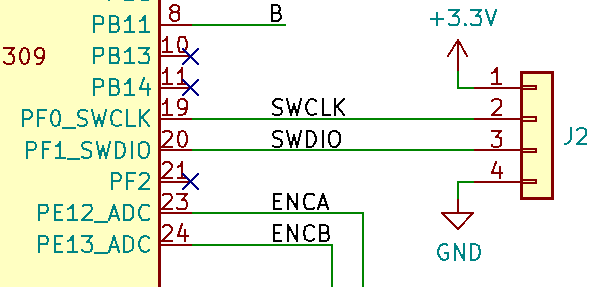{width=50%}

 - Used to program bootloader into the microcontroller
 - Can be used to debug microcontroller code with GDB
 - Symbol: Connector_Generic:Conn_01x04
 - Footprint: Connector_PinHeader_2.54mm:PinHeader_1x04_P2.54mm_Vertical

## Misc

 - tooling holes for stencil alignment
 - power flags for ERC
 - run ERC

## PCB Layout - design rule setup
 - File->Board Setup
 - Select layer count

## Create LED footprint

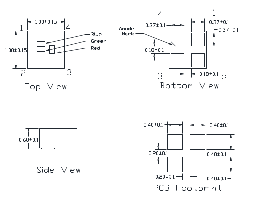{width=50%}

## Placement

 - First place parts with mechanical location requirements
 - Place remaining components minimizing connection lengths

## Routing
 - Add a ground plane
 - Add ground vias
 - Avoid placing vias in pads - air bubbles, paste sucked down hole
 - Set thermal relief as desired on through hole parts
 - Trace width consideration
   * Thermal, resistance - use Kicad's calculator
   * Design rules
   * Mechanical robustness
   * Impedance (advanced topic)

## Board outline

 - Edge.Cuts layer
 - Segments must exactly meet
 - Rounded corners are nice for handling

## Silkscreen, decoration

 - Label connector pins if space available
 - Identification text
 - Logos, artwork if desired

## Order PCB

 - run design rule check
 - [https://oshpark.com](https://oshpark.com)
 - browse for files button
 - select your .kicad_pcb file
 - review plots
 - add to cart and pay

## Gerber, Excellon files

 - Most board manufacturers require this format (zipped)
 - File per layer plus drill files
 - File->Plot
 - Check all
 - set output folder (you get a large number of files)
 - Plot
 - Drill file
 - View with gerber viewer
 - zip and send to manufacturer

## Order stencil

 Send your .kicad_pcb file to the instructor to be arrayed with the others and ordered. If ordering on your own do the following:

 - File->Plot
 - uncheck all but F.Paste (B.Paste if double sided)
 - Plot
 - order from [https://oshstencils.com](https://oshstencils.com)
